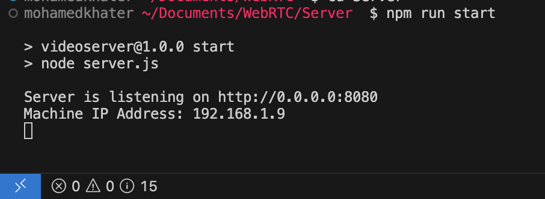

# WebRTC
This is a simple demo of **WebRTC** in Swift for iOS, JavaScript for Web and Server side (Signaling).


## Table of Content
- [Overview](#overview)
- [WebRTC Key Concepts](#webrtc-key-concepts)
- [Use Case](#use-case)
- [Run Demo](#run-demo)
- [iOS Implementation](#ios-implementation)
- [References](#resources)

## Overview
This repo contain 3 main folders:
- **Server**
    - Which contain server side that communicate between users via **WebSocket** using Nodejs.
- **Mobile**
    - Which contain a demo for iOS using Swift, UIKit & SwiftUI.
- **Web**
    - Which contain a demo for Web using JavaScript & HTML.

I added explanation of Swift implementation, for Web there are tons of Youtube videos and articles that explain it. 

## WebRTC Key Concepts


- **NAT**: Network Address Translation
    - Home Router is the NAT, Router has public IP Address and Client has private IP Address, Router called gateway that communicate Client with public servers.
- **STUN**, **TURN**
    - **STUN**: Session Traversal Utilities for NAT is used to get the public IP Address and Port through NAT, it works with **Full-cone NAT** and **Port/Address restricted NAT** only.
    - **TURN**: Traversal Using Relay around NAT, only used for **Symmetric NAT** to get public IP Address and Port.
- **ICE**: Interactive Connectivity Establishment
    - Collection of information about how other peers can communicate with the current local peer.
- **SDP**: Session Description Protocol
    - Also called Offer and Answer.
    - A format that describes ICE candidates, networking, options, media options, security options and other stuff, not really a protocol it's a format.
    - The goal is to take the SDP generated by the client and send it to the other client.
- **Signaling** the SDP (send SDP via WebSocket, WhatsApp or any messaging technology).

> **WebRTC** by default uses **UDP** but it can configure to use **TCP**

## Use Case
Client A want to share Video and/or Audio with Client B

- Client A & Client B need to find their public communication info of them self (public IP address, supported video comparison)
- Client A send it's public communication info to Client B via Signaling Protocol (ex WebSocket)
- Client B send it's public communication info to Client A via Signaling Protocol (ex WebSocket)
- Client A connects to Client B via the most optimal path
- Client A & Client B exchange their supported media and security

Steps to establish connection between two peers:
1. Client A: Create Offer
1. Client A: Set Offer as Local SDP
1. Client A: Send Offer
1. Client B: Receive Offer
1. Client B: Set Off as Remote SDP
1. Client B: Create Answer
1. Client B: Set Answer as Local SDP
1. Client B: Send Answer
1. Client A: Set Answer as Remote SDP
1. Client A: Wait until gathering ICE Candidate completed -> Send all ICE Candidate
1. Client B: Wait until gathering ICE Candidate completed -> Send all ICE Candidate
1. Peer Connection Completed
> Note: Set ICE Candidate after set local and remote SDP for each peer.

## Run Demo
This section will show you how to setup and run the demo project for Web and iOS Mobile.

### Step One
Make sure you have `Nodejs` installed in your machine.

Open terminal then go to `Server` folder
```
cd Server
```
Then run the following command to start the server
```
npm run start
```
It will show you two lines

- First line is the local machine and the port is listening too
- Second line contain the local IP Address of the machine this IP Address we will be used in the iOS demo project.


Now your local machine is act as Server.

### Step two
- Make sure your Router doesn't using **Symmetric NAT**, If so then you will need to add TRUN server to the peer connection configuration.
- Make sure both your machine and the real device are connected to the same Wifi.

Setup the Web Peer
1. Open browser and enter in the url `http:localhost:8080`
1. When the page is loaded it will request sharing screen or camera access, accept the request.

Setup the Mobile Peer
1. Navigate to **Mobile/WebRTCDemo** folder and open `WebRTCDemo.xcodeproj` with **Xcode**
1. Open `WebSocketClient.swift` and change the string value of `webSocketURL` with Machine IP Address from [step one](#step-one) ex: `"ws://192.168.1.9"`
1. Connect your real device and select it as run destination.
1. Click on Run button.
1. When the app is launched it will ask for Camera access permission press on **Allow** button
1. Press on **Call** button, you will see front camera capture video on bottom trailing corner

Wait for few seconds and you will see the Local Video from the Web app display on your device and local video from device display in Remote Video in the Web app.

https://github.com/user-attachments/assets/770de43f-84d7-43db-90dc-e8bc600168c0

## iOS Implementation
For iOS, I used [WebRTC](https://github.com/stasel/WebRTC) binary framework, I try to use the official binary framework from [GoogleWebRTC](https://cocoapods.org/pods/GoogleWebRTC) but it didn't work well I don't know why!

I will walk through the setup of local and remote stream because it's the trickiest part the other implementation of sending and receiving SDP and ICE candidates can found in the project or articles.

### Setup PeerConnection
```swift
// Media Constraints will be used in initializing the peerConnection also to creating Offer and Answer
private let mediaConstraints: RTCMediaConstraints = RTCMediaConstraints(
    mandatoryConstraints: nil,
    optionalConstraints: [
        kRTCMediaConstraintsOfferToReceiveAudio: kRTCMediaConstraintsValueTrue,
        kRTCMediaConstraintsOfferToReceiveVideo: kRTCMediaConstraintsValueTrue
    ]
)

// Factory will be used to initialize all objects needed to 
// setup WebRTC (Local Stream, Remote Stream, PeerConnection)
private let factory: RTCPeerConnectionFactory = RTCPeerConnectionFactory(
    encoderFactory: RTCDefaultVideoEncoderFactory(),
    decoderFactory: RTCDefaultVideoDecoderFactory()
)

private var peerConnection: RTCPeerConnection?
```

Set `peerConnection`
```swift
private func setPeerConnection() {
    let config = RTCConfiguration()
    // For STUN server, the URL must start with "stun:"
    // For TRUN server, the URL must start with "trun:"
    // example: STUN URL is "mystunserver.com:PORTNumber"
    // then you need to add it like this "stun:mystunserver.com:PORTNumber"
    config.iceServers = [
        RTCIceServer(urlStrings: [
            // STUN and/or TRUN servers urls
            // ex "stun:mystunserver.com:PORTNumber"
        ])
    ]
    
    peerConnection = factory.peerConnection(with: config, constraints: mediaConstraints, delegate: self)
}
```

### Setup Local Stream
Render and send local peer video.
> The code below show how to track local peer video only without audio.

Fist we need to add Camera & Microphone access permission in `info.plist` file
```
// Camera
<key>NSCameraUsageDescription</key>
<string>We need access to your camera for video calls</string>

// Microphone
<key>NSMicrophoneUsageDescription</key>
<string>We need access to your microphone for audio calls</string>
```
Then we need an object to store local peer track and capture.
```swift
class LocalStream {
    var track: RTCVideoTrack?
    var capture: RTCVideoCapturer?
    // Add other properties related to audio track
}
```
Inside `WebRTCClient` class create an object of `LocalStream`.

**NOTE**: you need to store local track and capture session in class scope otherwise the local peer video track will not be sended to the other peer and it not capture user video.
```swift
let localStream = LocalStream()
```
Then we need to capture the local peer video using mobile camera.
```swift
func trackLocalStream(showOn view: UIView, contentMode: UIView.ContentMode, position: AVCaptureDevice.Position) {
    // Check if the user allow camera access
    let videoAuthorizationStatus = AVCaptureDevice.authorizationStatus(for: .video)
    guard videoAuthorizationStatus == .authorized else { return }
    
    let videoSource = factory.videoSource()
    
    let videoTrack = factory.videoTrack(with: videoSource, trackId: UUID().uuidString)
    localStream.track = videoTrack
    
    let capture = RTCCameraVideoCapturer(delegate: videoSource)
    localStream.capture = capture
    
    // Start Capture local Video
    if let device = AVCaptureDevice.default(.builtInWideAngleCamera, for: .video, position: position) {
        let format = device.activeFormat
        
        // Get the highest FPS
        let fps = device.activeFormat.videoSupportedFrameRateRanges.max { $0.maxFrameRate < $1.maxFrameRate }?.maxFrameRate ?? 30
        
        capture.startCapture(with: device, format: format, fps: Int(fps))
        
        // Show local video on given view
        DispatchQueue.main.async {
            let localVideoRender = RTCMTLVideoView(frame: view.bounds)
            localVideoRender.videoContentMode = contentMode
            view.addSubview(localVideoRender)
            videoTrack.add(localVideoRender) // Will display video captured by AVCaptureSession
        }
    }
    
    // Send local track to remote peer
    peerConnection?.add(videoTrack, streamIds: [UUID().uuidString])
}
```

### Setup Remote Stream
Render remote peer video.
> The code below show how to display remote peer video only without audio.

First we need an object to store remote peer track and view that present the video.
```swift
class RemoteStream {
    /// View that will present remote peer video
    var view: UIView?
    /// Content Mode of remote peer video
    var contentMode: UIView.ContentMode = .scaleAspectFit
    /// Remote peer track
    var track: RTCVideoTrack?

    // Add other properties related to audio track
}
```

Inside `WebRTCClient` class create an object of `RemoteStream`.

**NOTE**: you need to store remote track in class scope otherwise the remote peer video will not displayed.
```swift
let remoteStream = RemoteStream()
```

Then we need to set the view that will present the remote peer video when it available
```swift
func trackRemoteStream(showOn view: UIView, contentMode: UIView.ContentMode) {
    remoteStream.view = view
    remoteStream.contentMode = contentMode
}
```

Render remote peer video.
```swift
// This method will be called when we get remote stream in RTCPeerConnectionDelegate
func renderRemoteStream(from track: RTCVideoTrack) {
    guard let view = remoteStream.view else { return }
    remoteStream.track = track
    
    DispatchQueue.main.async { [weak self] in
        guard let self else { return }
        let remoteVideoRender = RTCMTLVideoView(frame: view.bounds)
        remoteVideoRender.videoContentMode = remoteStream.contentMode
        view.addSubview(remoteVideoRender)
        track.add(remoteVideoRender) // Will display remote video
    }
}

// RTCPeerConnectionDelegate method
func peerConnection(_ peerConnection: RTCPeerConnection, didAdd stream: RTCMediaStream) {
    print("Remote track received")
    for track in stream.videoTracks {
        renderRemoteStream(from: track)
    }
}
```
That is all to show remote peer video.

## Resources
- [WebRTC Crash Course](https://www.youtube.com/watch?v=FExZvpVvYxA)
- [WebRTC in Swift. In simple words about the complex](https://medium.com/@ivanfomenko/webrtc-in-swift-in-simple-words-about-the-complex-d9bfe37d4126)
- [Implement WebRTC in iOS to Build Real-time App using Swift](https://www.videosdk.live/developer-hub/webrtc/webrtc-ios)
- [Capturing Video on iOS](https://www.objc.io/issues/23-video/capturing-video/)
